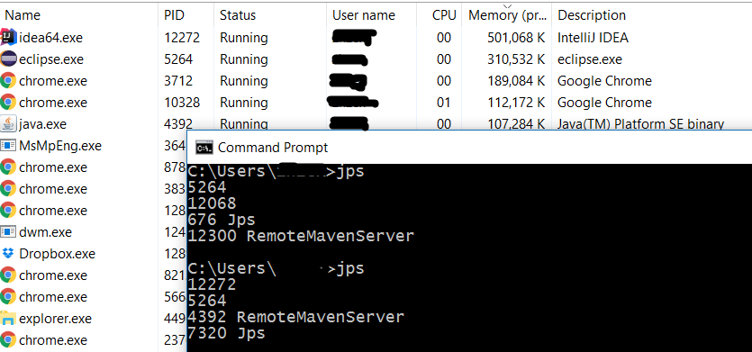

## How to Find Java Process Id

In Linux, use `ps -C java -o pid`.
In Windows, use `tasklist /m java*`.

With windows task manager, you can identify the processes in the GUI as shown in the screenshot below.

On both platforms, use `jps` on the command line also gives the process ids.As shown in the screenshot above, there were 3 processed opened by Eclipse, IntelliJ Idea, and the Maven plugin used by IntelliJ.
